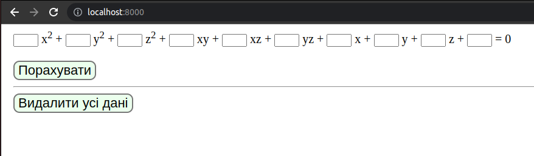
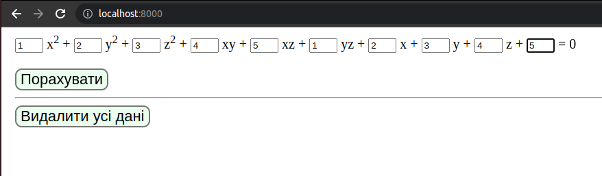
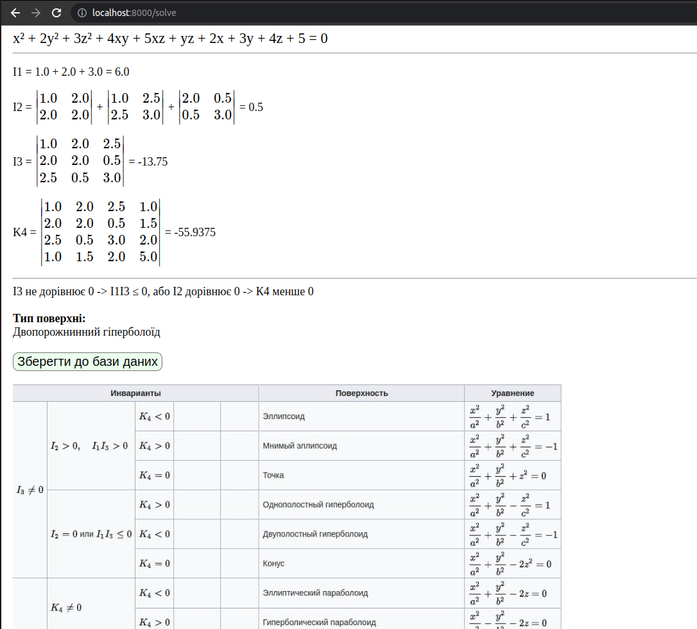
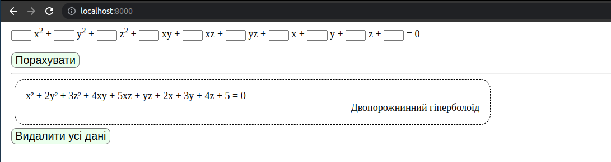

# Додаткова лабораторна робота
___
## Мета
Розробити веб-інтерфейс, що дозволяє задавати поверхні другого
порядку та відображати результати для попередньо оцінених поверхонь. У користувача
має  бути  можливість  переглянути  список  вже  визначених  поверхонь.
___
## Приклад роботи:
Початкова сторінка:

Введемо деякі дані:

Порахуємо:

Збережемо до бази даних тим самим перейшовши на початкову сторінку:

___
## Запуск:
Після запуску сайт можна переглянути на [**localhost:8000**](http://localhost:8000/)

Для запуску був розроблений *Makefile* і docker.\
Приклади найважливіших команд:
1. `make runAll` - для першого запуску
2. `make start` - запускає зупинені контейнери
3. `make stop` - зупиняє запущені контейнери
4. `make Stop_removeAll` - зупиняє контейнери, видаляє, і видаляє образ програми (без образу postgres)
